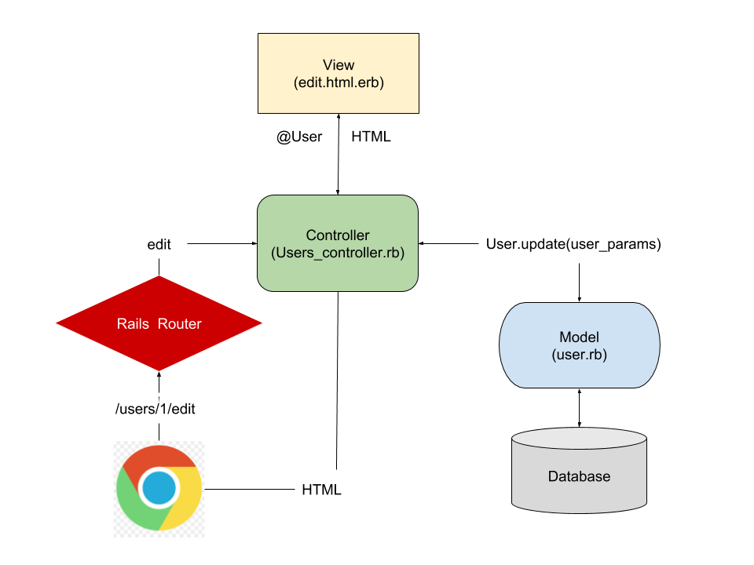
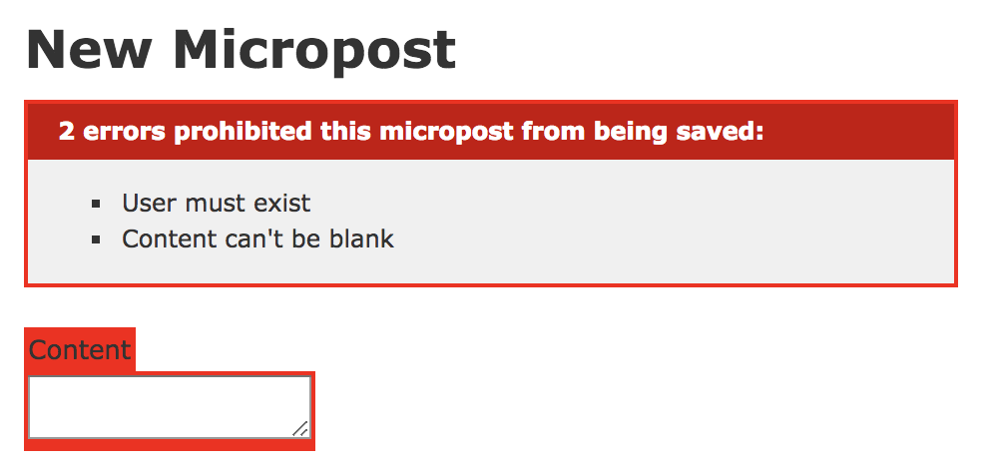
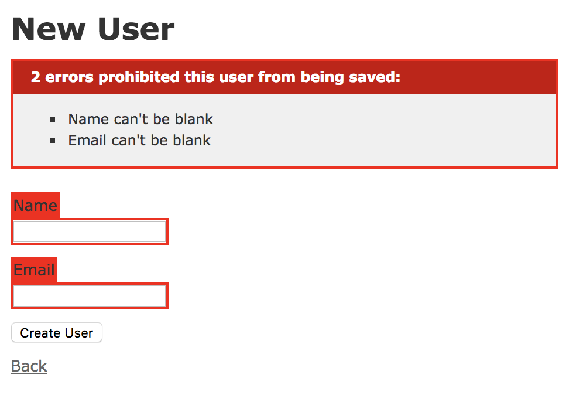
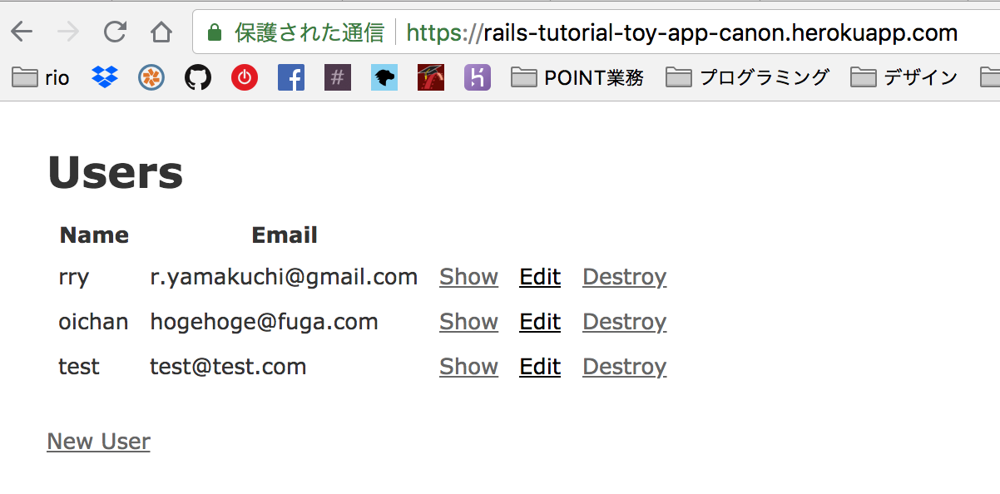
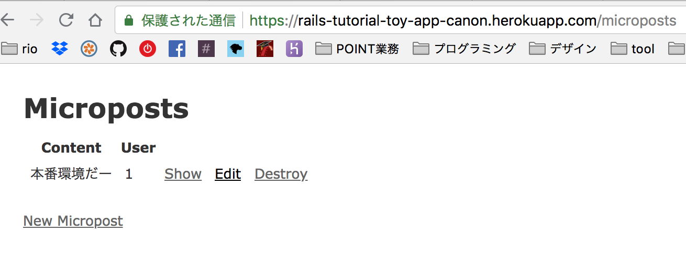
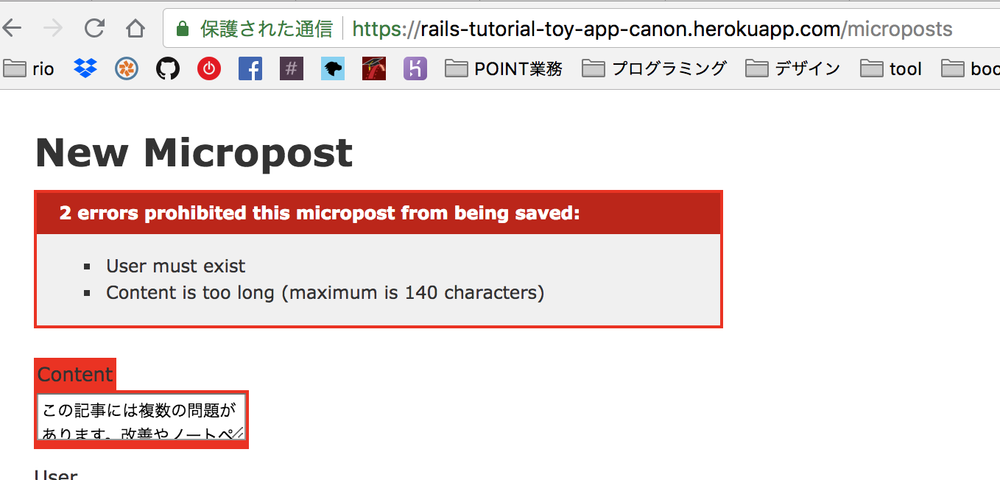
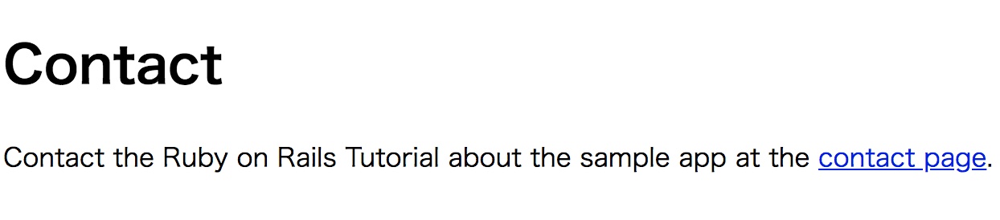
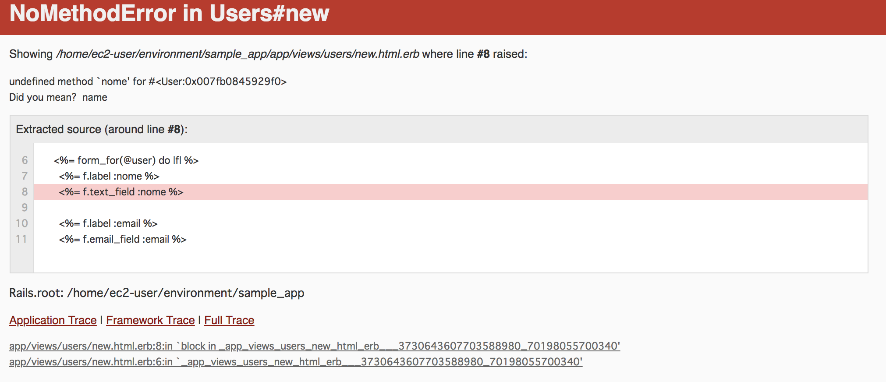
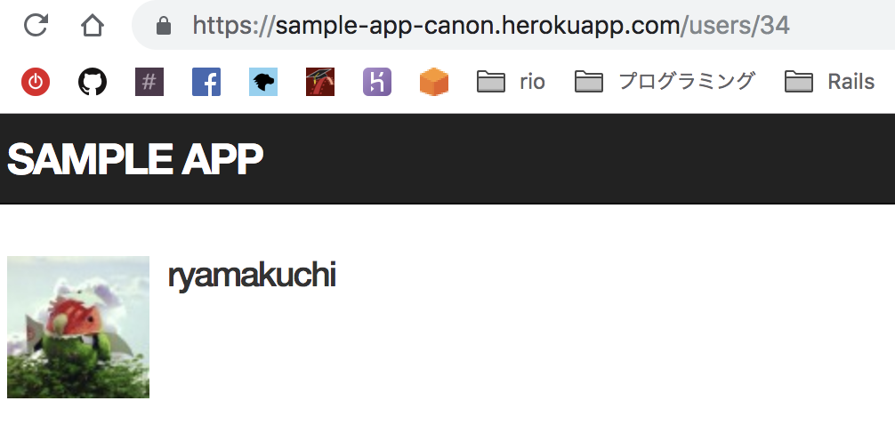
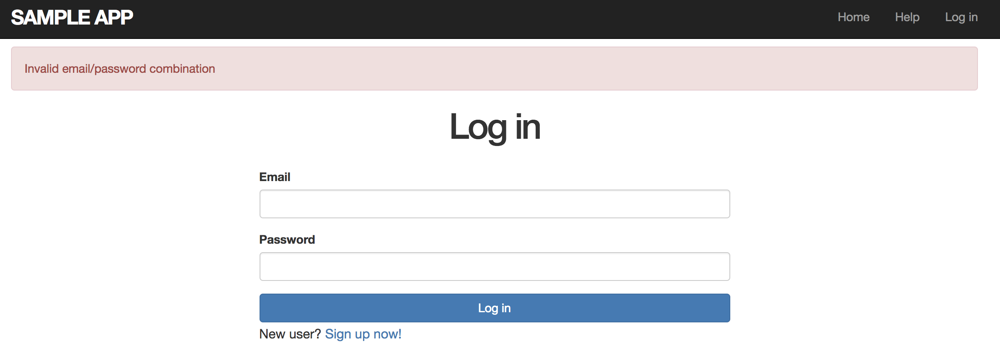

Ruby on Rails チュートリアル


## 演習デモ

1. Ruby on Railsで使うRuby gemはどのWebサイトにありますか？
* https://rubygems.org/

2. 現時点でのRailsの最新バージョンはいくつですか？
* 5.2.1 (2018/09/08 現在)
* https://rubygems.org/gems/rails

3. Ruby on Railsはこれまでに何回ダウンロードされたでしょうか？調べてみてください。
* 142,669,111 (2018/09/08 現在)
* https://rubygems.org/gems/rails


## 1.3.2 rails server

1. デフォルトのRailsページに表示されているものと比べて、今の自分のコンピュータにあるRubyのバージョンはいくつになっていますか? コマンドラインでruby -vを実行することで簡単に確認できます。
* `ruby 2.4.1p111 (2017-03-22 revision 58053) [x86_64-linux]`

2. 同様にして、Railsのバージョンも調べてみましょう。調べたバージョンはリスト 1.1でインストールしたバージョンと一致しているでしょうか?
* `Rails 5.1.6`


## 1.3.4 Hello, world!

1. リスト 1.7のhelloアクションを書き換え、「hello, world!」の代わりに「hola, mundo!」と表示されるようにしてみましょう。
* OK

2. Railsでは「非ASCII文字」もサポートされています。「¡Hola, mundo!」にはスペイン語特有の逆さ感嘆符「¡」が含まれています
* OK

3. リスト 1.7のhelloアクションを参考にして、２つ目のアクションgoodbyeを追加しましょう。このアクションは、「goodbye, world!」というテキストを表示します。リスト 1.9のルーティングを編集して、ルートルーティングの割り当て先をhelloアクションからgoodbyeアクションに変更します
* OK


## 1.5.3 Herokuにデプロイする (2)

1. 1.3.4.1と同じ変更を行い、本番アプリでも「hola, mundo!」を表示できるようにしてください。
* OK

2. 1.3.4.1と同様、ルートへのルーティングを変更してgoodbyeアクションの結果が表示されるようにしてください。またデプロイ時には、Git pushのmasterをあえて省略し、git push herokuでデプロイできることを確認してみてください。
* OK


## 2.2.1 ユーザーページを探検する

1. CSSを知っている読者へ: 新しいユーザーを作成し、ブラウ���のHTMLインスペクター機能を使って「User was successfully created.」の箇所を調べてみてください。ブラウザをリロードすると、その箇所はどうなるでしょうか?
* 要素の中の文字だけ消える(Rubyの変数が出力されている?)

2. emailを���力せず、名前だけを入力しようとした場合、どうなるでしょうか?「@example.com」のような間違ったメールアドレスを入力して更新しようとした場合、どうなるでしょうか?
* 更新されてしまう

3. 上記の演習で作成したユーザーを削除してみてください。ユーザーを削除したとき、Railsはどんなメッセージを表示するでしょうか?
* `User was successfully destroyed.`


## 2.2.2 MVCの挙動

1. 図 2.11を参考にしながら、/users/1/edit というURLにアクセスしたときの振る舞いについて図を書いてみてください。


2. 図示した振る舞いを見ながら、Scaffoldで生成されたコードの中でデータベースからユーザー情報を取得しているコードを探してみてください。
```
# app/controllers/users_controller.rb
# Never trust parameters from the scary internet, only allow the white list through.
    def user_params
      params.require(:user).permit(:name, :email)
    end
```

ユーザーの情報を編集するページのファイル名は何でしょうか?
* edit.html.erb


## 2.3.1 マイクロポストを探検する

1. CSSを知っている読者へ: 新しいマイクロポストを作成し、ブラウザのHTMLインスペクター機能���使って「Micropost was successfully created.」の箇所を調べてみてください。ブラウザをリロードすると、その箇所はどうなるでしょうか?
* `<p id="notice">Micropost was successfully created.</p>`となっている。多分変数。リロードすると消える。

2. マイクロポストの作成画面で、ContentもUserも空にして作成しようとするどうなるでしょうか?
* `Micropost was successfully created.` 空のまま作られる。

3. 141文字以上の文字列をContentに入力した状態で、マイクロポストを作成しようとするとどうなるでしょうか? (ヒント: WikipediaのRubyの記事にある１段落目がちょうど150文字程度ですが、どうなりますか?)
* 141文字以上のデータが登録される

4. 上記の演習で作成したマイクロポストを削除してみましょう。
* OK


## 2.3.2 マイクロポストをマイクロにする

1. 先ほど2.3.1.1の演習でやったように、もう一度Contentに141文字以上を入力してみましょう。どのように振る舞いが変わったでしょうか?
* バリデーションエラーになった

2. CSSを知っている読者へ: ブラウザのHTMLインスペクター機能を使って、表示されたエラーメッセージを調べてみてください。
```
<div id="error_explanation">
  <h2>1 error prohibited this micropost from being saved:</h2>

  <ul>
    <li>Content is too long (maximum is 140 characters)</li>
  </ul>
</div>
```
これが表示されていて、これもリロードすると消えた。


## 2.3.3 ユーザーはたくさんマイクロポストを持っている

1. ユーザーのshowページを編集し、ユーザーの最初のマイクロポストを表示してみましょう。同ファイル内の他のコードから文法を推測してみてください (コラム 1.1で紹介した技術の出番です)。うまく表示できたかどうか、/users/1 にアクセスして確認してみましょう。
```
<p>
  <strong>first micropost:</strong>
  <%= @user.microposts.first.content %>
</p>
```

2. リスト 2.16は、マイクロポストのContentが存在しているかどうかを検証するバリデーションです。マイクロポストが空でないことを検証できているかどうか、実際に試してみましょう (図 2.16のようになっていると成功です)。


3. リスト 2.17のFILL_INとなっている箇所を書き換えて、Userモデルのnameとemailが存在していることを検証してみてください (図 2.17)。



## 2.3.4 継承の階層

1. Applicationコントローラのファイルを開き、ApplicationControllerがActionController::Baseを継承している部分のコードを探してみてください。
```
# app/controllers/application_controller.rb
class ApplicationController < ActionController::Base
```

2. ApplicationRecordがActiveRecord::Baseを継承しているコードはどこにあるでしょうか? 先ほどの演習を参考に、探してみてください。ヒント: コントローラと本質的には同じ仕組みなので、app/modelsディレクトリ内にあるファイルを調べてみると...?)
```
# app/models/application_record.rb
class ApplicationRecord < ActiveRecord::Base
  self.abstract_class = true
end
```


## 2.3.5 アプリケーションをデプロイする

1. 本番環境で２〜３人のユーザーを作成してみましょう。


2. 本番環境で最初のユーザーのマイクロポストを作ってみましょう


3. マイクロポストのContentに141文字以上を入力した状態で、マイクロポストを作成してみましょう。リスト 2.13で加えたバリデーションが本番環境でもうまく動くかどうか、確認してみてください。



## 3.1 セット�����ップ

1. BitbucketがMarkdown記法のREADME (リスト 3.3) をHTMLとして正しく描画しているか、確認してみてください。
* Githubで確認した

2. 本番環境 (Heroku) のルートURLにアクセスして、デプロイが成功したかどうか確かめてみてください。
* できてた


## 3.2.1 静的なページの生成

1. Fooというコントローラを生成し、その中にbarとbazアクションを追加してみてください。
* `rails generate controller Foo bar baz`

2. コラム 3.1で紹介したテクニックを駆使して、Fooコントローラとそれに関連するアクションを削除してみてください。
* `rails destroy controller Foo bar baz`


## 3.4.2 タイトルを追加する (Green)

1. StaticPagesコントローラのテスト (リスト 3.24) には、いくつか繰り返しがあったことにお気づきでしょうか? 特に「Ruby on Rails Tutorial Sample App」という基本タイトルは、各テストで毎回同じ内容を書いてしまっています。そこで、setupという特別なメソッド (各テストが実行される直前で実行されるメソッド) を使って、この問題を解決したいと思います。まずは、リスト 3.30のテストが green になることを確認してみてください (リスト 3.30では、2.2.2で少し触れたインスタンス変数や文字列の式展開というテクニックを使っています。それぞれ4.4.5と4.2.2で詳しく解説する��で、今はわからなくても問題ありません)。
* GREENになった
* 3 runs, 6 assertions, 0 failures, 0 errors, 0 skips


## 3.4.3 レイアウトと埋め込みRuby (Refactor)

1. サンプルアプリケーションにContact (問い合わせ先) ページを作成してください16 (ヒント: まずはリスト 3.15を参考にして、/static_pages/contactというURLのページに「Contact | Ruby on Rails Tutorial Sample App」というタイトルが存在するかどうかを確認するテストを最初に作成しましょう。次に、3.3.3でAboutページを作ったときのと同じように、Contactページにもリスト 3.40のコンテンツを表示してみましょう。)。



## 3.4.4 ルーティングの設定

1. リスト 3.41にrootルーティングを追加したことで、root_urlというRailsヘルパーが使えるようになりました (以前、static_pages_home_urlが使えるようになったときと同じです)。リスト 3.42のFILL_INと記された部分を置き換えて、rootルーティングのテストを書いてみてください。
```
  test "should get root" do
    get root_url
    assert_response :success
    assert_select "title", "Home | #{@base_title}"
  end
```

2. 実はリスト 3.41のコードを書いていたので、先ほどの課題のテストは既に green になっているはずです。このような場合、テストを変更する前から成功していたのか、変更した後に成功するようになったのか、判断が難しいです。リスト 3.41のコードがテスト結果に影響を与えていることを確認するため、リスト 3.43のようにrootルーティングをコメントアウトして見て、 red になるかどうか確かめてみましょう (なおRubyのコメント機能については4.2.1で説明します)。最後に、コメントアウトした箇所を元に戻し (すなわちリスト 3.41に戻し)、テストが green になることを確認してみましょう。

* OK, なった!!!


## 4.2.2 文字列
1. city変数に適当な市区町村を、prefecture変数に適当な都道府県を代入してください。
```
?> city = "江東区"
=> "江東区"
>> prefecture = "東京"
=> "東京
```

2. 先ほど作った変数と式展開を使って、「東京都 新宿区」のような住所の文字列を作ってみましょう。出力にはputsを使ってください。
```
?> "#{prefecture} #{city}"                                                                                                     
=> "東京都 ���東区"
```

3. 上記の文字列の間にある半角スペースをタブに置き換えてみてください。(ヒント: 改行文字と同じで、タブも特殊文字です)
```
>> print "#{prefecture}\t#{city}"
東京    江東区=> nil
```

4. タブに置き換えた文字列を、ダブルクォートからシングルクォートに置き換えてみるとどうなるでしょうか?
```
?> print '#{prefecture}\t#{city}'
#{prefecture}\t#{city}=> nil
```


## 4.2.3 オブジェクトとメッセージ受け渡し
1. "racecar" の文字列の長さはいくつですか? lengthメソッドを使って調べてみてください。
```
>> "racecar".length
=> 7
```

2. reverseメソッドを使って、"racecar"の文字列を逆から読むとどうなるか調べてみてください。
```
>> "racecar".reverse
=> "racecar"
```

3. 変数sに "racecar" を代入してください。その後、比較演算子 (==) を使って変数sとs.reverseの値が同じであるかどうか、調べてみてください。
```
>> puts "true" if s == s.reverse
true
=> nil
```

4. リスト 4.9を実行すると、どんな結果になるでしょうか? 変数sに "onomatopoeia" という文字列を代入するとどうなるでしょうか?
ヒント: 上矢印 (またはCtrl-P���マ��ド) を使って以前に使ったコマンドを再利用すると一からコマンドを全部打ち込む必要がなくて便利ですよ。)
```
>> s = "onomatopoeia"
=> "onomatopoeia"
>> puts "It's a palindrome!" if s == s.reverse
=> nil
```


## 4.2.4 メソッドの定義
1. リスト 4.10のFILL_INの部分を適切なコードに置き換え、回文かどうかをチェックするメソッドを定義してみてください。
ヒント: リスト 4.9の比較方法を参考にしてください。
```
def palindrome_tester(s)
   if s == s.reverse
     puts "It's a palindrome!"
   else
     puts "It's not a palindrome."
   end
end
```

2. 上で定義したメソッドを使って “racecar” と “onomatopoeia” が回文かどうかを確かめてみてください。１つ目は回文である、２つ目は回文でない、という結果になれば成功です。
```
>> puts palindrome_tester("racecar")
It's a palindrome!

>> puts palindrome_tester("onomatopoeia")
It's not a palindrome.
```

3. palindrome_tester("racecar")に対してnil?メソッドを呼び出し、戻り値がnilであるかどうかを確認してみてください (つまりnil?を呼び出した結果がtrueであることを確認してください)。
このメソッドチェーンは、nil?メソッドがリスト 4.10の戻り値を受け取り、その結���を返しているという意味になります。
```
?> palindrome_tester("racecar").nil?
It's a palindrome!
=> true
```


## 4.3.1 配列と範囲演算子
1. 文字列 “A man, a plan, a canal, Panama” を ", " で分割して配列にし、変数aに代入してみてください。
```
>> a = "A man, a plan, a canal, Panama".split(',')
=> ["A man", " a plan", " a canal", " Panama"]
```

2. 今度は、変数aの要素を連結した結果 (文字列) を、変数sに代入してみてください。
```
>> s = a.join
=> "A man a plan a canal Panama"
```

3. 変数sを半角スペースで分割した後、もう一度��結し��文字��にして��ださい
(ヒント: メソッドチェーンを使うと１行でもできます)。
リスト 4.10で使った回文をチェックするメソッドを使って、
(現状ではまだ) 変数sが回文ではないことを確認してください。
downcaseメソッドを使って、s.downcaseは回文であることを確認してください。
```
?> s.split(',').join
=> "A man a plan a canal Panama"

?> palindrome_tester(s.split(',').join)
It's not a palindrome.
=> nil
```

4. aからzまでの範囲オブジェクトを作成し、7番目の要素を取り出してみてください。
同様にして、後ろから７番目の要素を取り出してみてください。
(ヒント: 範囲オブジェクトを配列に変換するのを忘れないでください)
```
>> ('a'..'z').to_a[6]
=> "g"

>> ('a'..'z').to_a[-7]
=> "t"
```


## 4.3.2 ブロック
1. 範囲オブジェクト0..16を使って、各要素の２乗を出力してください。
```
>> (1..16).map { |i| i**2 }                                                                                                    
=> [1, 4, 9, 16, 25, 36, 49, 64, 81, 100, 121, 144, 169, 196, 225, 256]
```

2. yeller (大声で叫ぶ) というメソッドを定義してください。
このメソッドは、文字列の要素で構成された配列を受け取り、各要素を連結した後、大文字にして結果を返します。
例えばyeller([’o’, ’l’, ’d’])と実行したとき、"OLD"という結果が返ってくれば成功です。
ヒント: mapとupcaseとjoinメソッドを使ってみましょう。
```
def yeller(l = '')
  l.map(&:upcase).join
end

?> yeller(["o", "l", "d"])
=> "OLD"
```

3. random_subdomainというメソッドを定義してください。
このメソッドはランダムな8文字を生成し、文字列として返します。
ヒント: サブドメインを作るときに使ったRubyコードをメソッド化したものです。
```
>> def random_subdomain
>>   ('a'..'z').to_a.shuffle[0..7].join
>> end
=> :random_subdomain
>> 
?> random_subdomain
=> "lzndeosp"
>> random_subdomain
=> "vgxtjahf"
>> random_subdomain
=> "vohygitx"
```

4. リスト 4.12の「?」の部分を、それぞれ適切なメソッドに置き換えてみてください。
ヒント:split、shuffle、joinメソッドを組み合わせると、
メソッドに渡された文字列 (引数) をシャッフルさせることができます。
```
?> def string_shuffle(s)
>>  s.split('').shuffle.join
>> end
=> :string_shuffle
?> string_shuffle("foobar")
=> "orofab"
```

## 4.3.3 ハッシュとシンボル
1. キーが’one’、’two’、’three’となっていて、��れぞれ��値が’uno’、’dos��、’tres’となっているハッシュを作ってみてください。
その後、ハッシュの各要素をみて、それぞれのキーと値を"’#{key}’のスペイン語は’#{value}’"といった形で出力してみてください。
```
>> num = {}
>> num = { one: "uno", two: "dos", three: "tres" }
>> num.each do |key,value|
?> puts "’#{key}’のスペイン語は’#{value}’"
>> end

’one’のスペイン語は’uno’
’two’のスペイン語は’dos’
’three’のスペイン語は’tres’
=> {:one=>"uno", :two=>"dos", :three=>"tres"}
```

2. person1、person2、person3という３つのハッシュを作成し、それぞれのハッシュに:firstと:lastキーを追加し、
適当な値 (名前など) を入力してください。その後、次のようなparamsというハッシュのハッシュを作ってみてください。
1). キーparams[:father]の値にperson1を代入、
2). キーparams[:mother]の値にperson2を代入、
3). キーparams[:child]の値にperson3を代入。
最後に、ハッシュのハッシュを調べていき、正しい値になっているか確かめてみてください。
(例えばparams[:father][:first]がperson1[:first]と一致しているか確かめてみてください)
```
?> person1 = { first: "masu", last: "suzuki" }                                                                                 
=> {:first=>"masu", :last=>"suzuki"}
>> person2 = { first: "rio", last: "yamakuchi" }                                                                               
=> {:first=>"rio", :last=>"yamakuchi"}

>> params[:father] = person1                                                                                                   
=> {:first=>"masu", :last=>"suzuki"}
>> params[:mother] = person2
=> {:first=>"rio", :last=>"yamakuchi"}

?> params[:father][:first]
=> "masu"

>> params
=> {:father=>{:first=>"masu", :last=>"suzuki"}, :mother=>{:first=>"rio", :last=>"yamakuchi"}}
```

3. userというハッシュを定義してみてください。このハッシュは３つのキー:name、:email、:password_digestを持っていて、
それぞれの値にあなたの名前、あなたの���ールアドレス、そして16文字からなるランダムな文字列が代入されています。
```
?> user = { name: "ryamakuchi", email: "r.yamakuchi@gmail.com", password_digest: ('a'..'z').to_a.shuffle[0..15].join }         
=> {:name=>"ryamakuchi", :email=>"r.yamakuchi@gmail.com", :password_digest=>"orkjlfmzhstbgqea"}
```

4. Ruby API (訳注: もしくはるりまサーチ) を使って、Hashクラスのmergeメソッドについて調べてみてください。
次のコー��を実行��ずに、どのような結果が返ってくるか推測できますか? 
推測できたら、実際にコードを実行して推測があっていたか確認してみましょう。
`{ "a" => 100, "b" => 200 }.merge({ "b" => 300 })`
> selfとotherのハッシュの内容をマージ(統合)した結果を返します。デフォルト値はselfの設定のままです。
> https://docs.ruby-lang.org/ja/search/query:.merge/
{ "a" => 100, "b" => 300 }
>> hash = { "a" => 100, "b" => 200 }.merge({ "b" => 300 })
=> {"a"=>100, "b"=>300}

## 4.4.1 コンストラクタ
1. 1から10の範囲オブジェクトを生成するリテラルコンストラクタは何でしたか? (復習です)
a = (1..10)

2. 今度はRangeクラスとnewメソッドを使って、1から10の範囲オブジェクトを作ってみてください。ヒント: newメソッドに2つの引数��渡す必要があります
b = Range.new(1, 10)

3. 比較演算子==を使って、上記２つの課題で作ったそれぞれのオブジェクトが同じであることを確認してみてください。
```
>> a = (1..10)
=> 1..10
>> b = Range.new(1, 10)
=> 1..10
>> a == b
=> true
```

## 4.4.2 クラス継承
1. Rangeクラスの継承階層を調べてみてください。同様にして、HashとSymbolクラスの継承階層も調べてみてください。
Range > Class > Module > Oblect > BasicObject
Hash > Integer > Numeric > Oblect > BasicObject
Symbol > Class > Module > Oblect > BasicObject

2. リスト 4.15にあるself.reverseのselfを省略し、reverseと書いてもうまく動くことを確認してみてください。
```
?> class Word < String
>> def palindrome?
>> self == reverse
>> end
>> end
=> :palindrome?
>> s = Word.new("level")
=> "level"
>> s.palindrome?  
=> true
```


## 4.4.3 組み込みクラスの変更
1. palindrome?メソッドを使って、“racecar”が回文であり、“onomatopoeia”が回文でないことを確認してみてください。
2. 南インドの言葉「Malayalam」は回文でしょうか? ヒント: downcaseメソッドで小文字にすることを忘れないで。
```
?> s = Word.new("racecar")
=> "racecar"
>> s.palindrome?
=> true
>> s = Word.new("onomatopoeia")
=> "onomatopoeia"
>> s.palindrome?
=> false
>> m = "Malayalam".downcase                                                                                                    
=> "malayalam"
>> s = Word.new(m)
=> "malayalam"
>> s.palindrome?
=> true
```

2. リスト 4.16を参考に、Stringクラスにshuffleメソッドを追加してみてください。ヒント: リスト 4.12も参考になります。
```
?> class String
>> def shuffle
>> self.split('').shuffle.join
>> end
>> end
=> :shuffle
>> "foobar".shuffle
=> "robfao"
```

3. リスト 4.16のコードにおいて、self.を削除してもうまく動くことを確認してください。
```
>> class String
>> def shuffle
>> split('').shuffle.join
>> end
>> end
=> :shuffle
>> "foobar".shuffle
=> "rfooba"
```


## 4.4.4 コントローラクラス
1. 第2章で作ったToyアプリケーションのディレクトリでRailsコンソールを開き、
User.newと実行することでuserオブジェクトが生成できることを確認してみましょう。
```
>> u = User.new
=> #<User id: nil, name: nil, email: nil, created_at: nil, updated_at: nil>
```

2. 生成したuserオブジェクトのクラスの継承階層を調べてみてください。
User > ApplicationRecord(abstract) > ActiveRecord::Base > Object > BasicObject


## 4.4.5 ユーザークラス
1. Userクラスで��義されているname属性を修正して、first_name属性とlast_name属性に分割してみましょう。
また、それらの属性を使って "Michael Hartl" といった文字列を返すfull_nameメソッドを定義してみてください。
最後に、formatted_emailメソッドのnameの部分を、full_nameに置き換えてみましょう (元々の結果と同じになっていれば成功です)
```
>> require './example_user'
=> true
>> user = User.new(first_name: "Michael", last_name: "Hartl", email: "mhartl@example.com")
=> #<User:0x00000003e60610 @first_name="Michael", @last_name="Hartl", @email="mhartl@example.com">
>> user.full_name
=> "Michael Hartl"
>> user.formatted_email
=> "Michael Hartl <mhartl@example.com>"
```

2. "Hartl, Michael" といったフォーマット (苗字と名前がカンマ+半角スペースで区切られている文字列) 
で返すalphabetical_nameメソッドを定義してみましょう。
```
>> user = User.new(first_name: "Michael", last_name: "Hartl", email: "mhartl@example.com")
=> #<User:0x00000004b18150 @first_name="Michael", @last_name="Hartl", @email="mhartl@example.com">
>> user.alphabetical_name
=> "Michael, Hartl"
>> user.formatted_email_al
=> "Michael, Hartl <mhartl@example.com>"
```

3. full_name.splitとalphabetical_name.split(’, ’).reverseの結��を比較し、同じ結果になる��どうか確認してみましょう。
```
>> user.full_name.split
=> ["MichaelHartl"]
>> user.alphabetical_name.split(', ').reverse
=> ["Hartl", "Michael"]
>> user.formatted_email_full
=> "MichaelHartl <mhartl@example.com>"
>> user.formatted_email_al
=> "Michael, Hartl <mhartl@example.com>"
```


## 5.1.1 ナビゲーション
1. Webページと言ったらネコ画像、というぐらいにはWebにはネコ画像が溢れ������ますよね。
リスト 5.4���コマンドを使って、図 5.3のネコ画像をダウンロードしてきましょう8。
`にゃーん`

2. mvコマンドを使って、ダウンロードしたkitten.jpgファイルを適切なアセットディレクトリに移動してください (参考: 5.2.1)。
`mv kitten.jpg app/assets/images/kitten.jpg`

3. image_tagを使って、kitten.jpg画像を表示してみてください (図 5.4)。
`<%= link_to image_tag("kitten.jpg", alt: "kitten"), 'https://railstutorial.jp/chapters/filling_in_the_layout?version=5.1#fig-kitten_on_home' %>`


## 5.1.2 BootstrapとカスタムCSS
1. リスト 5.10を参考にして、5.1.1.1で使ったネコ画像をコメントアウトしてみてください。
また、ブラウザのHTMLインスペクタ機能を使って、コメントアウトするとHTMLのソースからも消えていることを確認してみてください。
おk

2. リスト 5.11のコードをcustom.scssに追加し、すべて��画像を非表示にしてみてください。
うまくいけば、Railsのロゴ画像がHomeページから消えるはずです。
先ほどと同様にインスペクタ機能を使って、今度はHTMLのソースコードは残ったままで、
画像だけが表示されなくなっていることを確認してみてください。
おk


## 5.1.3 パーシャル (partial)
1. Railsがデフォルト��生成するheadタグの部分を、リスト 5.18のようにrenderに置き換えてみてください。
ヒント: 単純に削除してしまうと後でパーシャルを１から書き直す必要が出てくるので、削除する前にどこかに退避しておきましょう。

2. リスト 5.18のようなパーシャルはまだ作っていないので、現時点ではテストは redになっているはずです。
実際にテストを実行して確認してみましょう。

3. layoutsディレクトリにheadタグ用のパーシャルを作成し、先ほど退避しておいたコードを書き込み、
最後にテストが green に戻ることを確認しましょう。

まとめておっけ


## 5.2 Sassとアセットパイプライン
1. 5.2.2で提案したように、footerのCSSを手作業で変換してみましょう。
具体的には、リスト 5.17の内容を１つずつ変換していき、リスト 5.20のようにしてみてください。
ok

## 5.3.2 RailsのルートURL
1. 実は名前付きルートは、as:オプションを使って変更することができます。
有名なFar Sideの漫画に倣って、Helpページの名前付きルートをhelfに変更してみてください (リスト 5.29)。
ok

2. 先ほどの変更により、テストが redに��っているこ��を確��してください��
リスト 5.28を���考にルーティングを更新して、テストを greenにして見てください。
ok

3. エディタのUndo機能を使って、今回の演習で行った変更を元に戻して見てください。
ok


## 5.3.3 名前付きルート
1. リスト 5.29のようにhelfルーティングを作成し、レイアウトのリンクを更新してみてください。
ok

2. 前回の演習と同様に、エディタのUndo機能を使ってこの演習で行った変更を元に戻してみてください。
ok


## 5.3.4 リンクのテスト
1. footerパーシャルのabout_pathをcontact_pathに変更してみて、
テストが正しくエラーを捕まえてくれるかどうか確認してみてください。
ok, エラーなった

2. リスト 5.35で示すように、Applicationヘルパーで使っているfull_titleヘルパーを、
test環境でも使える��うにすると便利です。
こうしておくと、リスト 5.36のようなコードを使って、正しいタイトルをテストすることができます。
ただし、これは完璧なテストではありません。
例えばベースタイトルに「Ruby on Rails Tutoial」といった誤字があったとしても、
このテストでは発見することができないでしょう。
この問題を解決するためには、full_title��ルパーに対するテストを書く必要があります。
そこで、Applicationヘルパーをテストするファイルを作成し、
リスト 5.37のFILL_INの部分を適切なコードに置き換えてみてください。
ヒント: リスト 5.37ではassert_equal <期待される値>, <実際の値>といった形で使っていましたが、
内部では==演算子で期待される値と実際の値を比較し、正しいかどうかのテストをしています。
```
require 'test_helper'

class ApplicationHelperTest < ActionView::TestCase
  test "full title helper" do
    assert_equal full_title,         "Ruby on Rails Tutorial Sample App"
    assert_equal full_title("Help"), "Help | Ruby on Rails Tutorial Sample App"
  end
end
```


## 5.4.1 Usersコントローラ
1. 表 5.1を参考にしながらリスト 5.41を変更し、users_new_urlではなくsignup_pathを使えるようにしてみてください。
```
require 'test_helper'

class UsersControllerTest < ActionDispatch::IntegrationTest
  test "should get signup" do
    get signup_path
    assert_response :success
  end

end
```

2. 先ほどの変更を加えたことにより、テストが redになったことを確認してください。
なお、この演習はテスト駆動開発 (コラム 3.3) で説明した red/green のリズムを作ることを目的としています。
このテストは次の5.4.2で greenになるよう修正します。
redになった


## 5.4.2 ユーザー登録用URL
1. もしまだ5.4.1.1の演習に取り掛かっていなければ、まずはリスト 5.41のように変更し、
名前付きルートsignup_pathを使えるようにしてください。
また、リスト 5.43で名前付きルートが使えるようになったので、
現時点でテストが greenになっていることを確認してください。
GREENなた

2. 先ほどのテストが正しく動いていることを確認するため、
signupルートの部分をコメントアウトし、テスト redになることを確認してください。
確認できたら、コメントアウトを解除して greenの状態に戻してください。
REDなた
GREENなた

3. リスト 5.32の統合テストにsignupページにアクセスするコードを追加してください(getメソッドを使います)。
コードを追加したら実際にテストを実行し、結果が正しいことを確認してください。
ヒント: リスト 5.36で紹介したfull_titleヘルパーを使ってみてください。
```
  test "full title signup" do
    assert_equal full_title,         "Ruby on Rails Tutorial Sample App"
    assert_equal full_title("Sign up"), "Sign up | Ruby on Rails Tutorial Sample App"
  end
```
  assert_select "a[href=?]", signup_path
```
  test "should get signup" do
    get signup_path
    assert_response :success
  end
```


## 6.1.1 データベースの移行
1. Railsはdb/ディレクトリの中にあるschema.rbというファイルを使っています。
これはデータベースの構造 (スキーマ (schema) と呼びます) を追跡するために使われます。
さて、あなたの環境にあるdb/schema.rbの内容を調べ、
その内容とマイグレーションファイル (リスト 6.2) の内容を比べてみてください。
```
# 20181013064540_create_users.rb

class CreateUsers < ActiveRecord::Migration[5.1]
  def change
    create_table :users do |t|
      t.string :name
      t.string :email

      t.timestamps
    end
  end
end
```
```
# schema.rb

ActiveRecord::Schema.define(version: 20181013064540) do

  create_table "users", force: :cascade do |t|
    t.string "name"
    t.string "email"
    t.datetime "created_at", null: false
    t.datetime "updated_at", null: false
  end

end
```
create_users で指定した��容がschema.rb に登録されている


2. ほぼすべてのマイグレーションは、元に戻すことが可能です
 (少なくとも本チュートリアルにおいてはすべてのマイグレーションを元に戻すことができます)。
元に戻すことを「ロールバック (rollback)と呼び、Railsではdb:rollbackというコマンドで実現できます。
`$ rails db:rollback` 上のコマンドを実行後、db/schema.rbの内容を調べてみて、
ロールバックが成功したかどうか確認してみてください 
```
ActiveRecord::Schema.define(version: 0) do
end
```
こうなって消えていた

(コラム 3.1ではマイグレーションに関する他のテクニックもまとめているので、参考にしてみてください)。
上のコマンドでは、データベースからusersテーブルを削除するためにdrop_tableコマンドを内部で呼び出していま��。
これが���まくいくのは、drop_tableとcreate_tableがそれぞれ対応していることをchangeメソッドが知っているからです。
この対応関係を知っているため、ロールバック用の逆方向のマイグレーションを簡単に実現することができるのです。
なお、あるカラムを削除するような不可逆なマイグレーションの場合は、changeメソッドの代わりに、
upとdownのメソッドを別々に定義する必要があります。
詳細については、Railsガイドの「Active Record マイグレーション」を参照してください。


3. もう一度rails db:migrateコマンドを実行し、db/schema.rbの内容が元に戻ったことを確認してください。
もとに戻った


## 6.1.2 modelファイル
1. Railsコンソールを開き、User.newでUserクラスのオブジェクトが生成されること、
そしてそのオブジェクトがApplicationRecordを継承していることを確認してみてください
(ヒント: 4.4.4で紹介したテクニックを使ってみてください)。
```
?> model = User.new                                                                                                     
=> #<User id: nil, name: nil, email: nil, created_at: nil, updated_at: nil>
>> model.class.superclass
=> ApplicationRecord(abstract)
```

2. 同様にして、ApplicationRecordがActiveRecord::Baseを継承していることについて確認してみてください。
```
>> model.class.superclass.superclass
=> ActiveRecord::Base
```


## 6.1.3 ユーザーオブジェクトを作成する
1. user.nameとuser.emailが、どちらもStringクラスのインスタンスであることを確認してみてください。
```
?> user.name.class
=> String
>> user.email.class
=> String
```

2. created_atとupdated_atは、どのクラスのインスタンスでしょうか?
```
>> user.created_at.class
=> ActiveSupport::TimeWithZone
>> user.updated_at.class
=> ActiveSupport::TimeWithZone
```


## 6.1.4 ユーザーオブジェクトを検索する
1. nameを使ってユーザーオブジェクトを検索してみてください。
また、 find_by_nameメソッドが使えることも確認してみてください 
(古いRailsアプリケーションでは、古いタイプのfind_byをよく見かけることでしょう)。
```
?> User.find_by(name: "Michael Hartl")                                                                                   
  User Load (0.2ms)  SELECT  "users".* FROM "users" WHERE "users"."name" = ? LIMIT ?  [["name", "Michael Hartl"], ["LIMIT", 1]]
=> #<User id: 1, name: "Michael Hartl", email: "mhartl@example.com", created_at: "2018-10-13 13:13:48", updated_at: "2018-10-13 13:13:48">
>> User.find_by_name("Michael Hartl")                                                                                    
  User Load (0.2ms)  SELECT  "users".* FROM "users" WHERE "users"."name" = ? LIMIT ?  [["name", "Michael Hartl"], ["LIMIT", 1]]
=> #<User id: 1, name: "Michael Hartl", email: "mhartl@example.com", created_at: "2018-10-13 13:13:48", updated_at: "2018-10-13 13:13:48">
```

2. 実用的な目的のため、User.allはまるで配列のように扱うことができますが、実際には配列ではありません。
User.allで生成されるオブジェクトを調べ、Arrayクラスではなく
User::ActiveRecord_Relationクラスであることを確認してみてください。
```
?> all = User.all
  User Load (0.1ms)  SELECT  "users".* FROM "users" LIMIT ?  [["LIMIT", 11]]
=> #<ActiveRecord::Relation [#<User id: 1, name: "Michael Hartl", email: "mhartl@example.com", created_at: "2018-10-13 13:13:48", updated_at: "2018-10-13 13:13:48">]>
>> all.class
=> User::ActiveRecord_Relation
```

3. User.allに対してlengthメソッドを呼び出すと、その長さを求められることを確認してみてください (4.2.3)。
Rubyの性質として、そのクラスを詳しく知らなくてもなんとなくオブジェクトをどう扱えば良いかわかる、
という性質があります。これをダックタイピング (duck typing) と呼び、よく次のような格言で言い表されています
「もしアヒルのような容姿で、アヒルのように鳴くのであれば、それはもうアヒルだろう」。
(訳注: そういえばRubyKaigi 2016の基調講演で、Ruby作者のMatzがダックタイピングについて説明していました。
２〜３分の短くて分かりやすい説明なので、ぜひ視聴してみてください!)
```
?> all.length
  User Load (0.2ms)  SELECT "users".* FROM "users"
=> 1
```


## 6.1.5 ユーザーオブジェクトを更新する
1. userオブジェクトへの代入を使ってname属性を使って更新し、saveで保存してみてください。
```
?> user.name = "rio"
=> "rio"
>> user.save
   (0.2ms)  SAVEPOINT active_record_1
  SQL (0.2ms)  UPDATE "users" SET "name" = ?, "updated_at" = ? WHERE "users"."id" = ?  [["name", "rio"], ["updated_at", "2018-10-13 13:53:23.481524"], ["id", 1]]
   (0.1ms)  RELEASE SAVEPOINT active_record_1
=> true
```

2. 今度はupdate_attributesを使って、email属性を更新および保存してみてください。
```
>>  user.update_attribute(:email, "r.yamakuchi@gmail.com")                                                   
   (0.1ms)  SAVEPOINT active_record_1
  SQL (0.2ms)  UPDATE "users" SET "email" = ?, "updated_at" = ? WHERE "users"."id" = ?  [["email", "r.yamakuchi@gmail.com"], ["updated_at", "2018-10-13 13:56:10.468942"], ["id", 1]]
   (0.1ms)  RELEASE SAVEPOINT active_record_1
=> true
```

3. 同様にして、マジックカラムであるcreated_atも直接更新できることを確認してみてください。
ヒント: 更新するときは「1.year.ago」を使うと便利です。
これはRails流の時間指定の１つで、現在の時刻から１年前の時間を算出してくれます。
```
>>  user.update_attribute(:created_at, 1.year.ago)                                             
   (0.1ms)  SAVEPOINT active_record_1
  SQL (0.1ms)  UPDATE "users" SET "created_at" = ?, "updated_at" = ? WHERE "users"."id" = ?  [["created_at", "2017-10-13 13:57:19.318555"], ["updated_at", "2018-10-13 13:57:19.319316"], ["id", 1]]
   (0.1ms)  RELEASE SAVEPOINT active_record_1
=> true
```


## 6.2.1 有効性を検証する
1. コンソールから、新しく生成したuserオブジェクトが有効 (valid) であることを確認してみましょう。
```
>> user = User.new
=> #<User id: nil, name: nil, email: nil, created_at: nil, updated_at: nil>
>> user.valid?
=> true
```

2. 6.1.3で生成したuserオブジェクトも有効であるかどうか、確認してみましょう。
```
?> User.new
=> #<User id: nil, name: nil, email: nil, created_at: nil, updated_at: nil>
```


## 6.2.2 存在性を検証する
1. 新しいユーザーuを作成し、作成した時点では有効ではない (invalid) ことを確認してください。
なぜ有効ではないのでしょうか? エラーメッセージを確認してみましょう。
```
>> u = User.new
=> #<User id: nil, name: nil, email: nil, created_at: nil, updated_at: nil>
>> u.save
   (0.1ms)  SAVEPOINT active_record_1
   (0.1ms)  ROLLBACK TO SAVEPOINT active_record_1
=> false
>> u.errors.full_messages
=> ["Name can't be blank", "Email can't be blank"]

```

2. u.errors.messagesを実行すると、ハッシュ形式でエラーが取得できることを確認してください。
emailに関するエラー情報だけを取得したい場合、どうやって取得すれば良いでしょうか?
```
>> u.errors.messages[:email]
=> ["can't be blank"]
```


## 6.2.3 長さを検証する
1. 長すぎるnameとemail属性を持ったuserオブジェクトを生成し、有効でないことを確認してみましょう
```
>> user = User.new(name: "a" * 51, email: "a" * 244 + "@example.com")
=> #<User id: nil, name: "aaaaaaaaaaaaaaaaaaaaaaaaaaaaaaaaaaaaaaaaaaaaaaaaaa...", email: "aaaaaaaaaaaaaaaaaaaaaaaaaaaaaaaaaaaaaaaaaaaaaaaaaa...", created_at: nil, updated_at: nil>
>> user.save
   (0.1ms)  SAVEPOINT active_record_1
   (0.1ms)  ROLLBACK TO SAVEPOINT active_record_1
=> false
```

2. 長さに関するバリデーションが失敗した時、どんなエラーメッセージが生成されるでしょうか? 確認してみてください。
```
>>  user.errors.full_messages
=> ["Name is too long (maximum is 50 characters)", "Email is too long (maximum is 255 characters)"]
```


## 6.2.4 フォーマットを検証する
1. リスト 6.18にある有効なメールアドレスのリストと、
```
user@example.com
USER@foo.COM
A_US-ER@foo.bar.org
first.last@foo.jp
alice+bob@baz.cn
```
リスト 6.19にある無効なメールアドレスのリスト
```
user@example,com
user_at_foo.org
user.name@example.
foo@bar_baz.com
foo@bar+baz.com
```
をRubularのYour test string:に転記してみてください。
その後、リスト 6.21の正規表現をYour regular expression:に転記して、
有効なメールアドレスのみがすべてマッチし、無効なメールアドレスはすべてマッチしないことを確認してみましょう。
OK

2. 先ほど触れたように、リスト 6.21のメールアドレスチェックする正規表現は、
foo@bar..comのようにドットが連続した無効なメールアドレスを許容してしまいます。
まずは、このメールアドレスをリスト 6.19の無効なメールアドレスリストに追加し、
これによってテストが失敗することを確認し���ください。
次に、リスト 6.23で示した、少し複雑な正規表現を使ってこのテストがパスすることを確認してください。
OK

3. foo@bar..comをRubularのメールアドレスのリストに追加し、リスト 6.23の正規表現をRubularで使ってみてください。
有効なメールアドレスのみがすべてマッチし、無効なメールアドレスはすべてマッチしないことを確認してみましょう。
OK


## 6.2.5 一意性を検証する
1. リスト 6.33を参考に、メールアドレスを小文字にするテストをリスト 6.32に追加してみましょう。
ちなみに追加するテストコードでは、データベースの値に合わせて更新するreloadメソッドと、
値が一致しているかどうか確認するassert_equalメソッドを使っています。
リスト 6.33のテストがうまく動いているか確認するためにも、
before_saveの行をコメントアウトして redになることを、
また、コメントアウトを解除すると greenになることを確認してみましょう。
OK

2. テストスイートの実行結果を確認しながら、before_saveコールバックをemail.downcase!に書き換えてみましょう。
ヒント: メソッドの末尾に!を付け��すことにより、email属性を直接変更できるようになり��す (リスト 6.34)。
!を付け足すとテストスイートが通らなくなる


## 6.3.2 ユーザーがセキュアなパスワードを持っている
1. この時点では、userオブジェクトに有効な名前とメールアドレスを与えても、valid?で失敗してしまうことを確認してみてください。
```
>> user = User.new(name: "ryamakuchi", email: "ryamakuchi@example.com")
=> #<User id: nil, name: "ryamakuchi", email: "ryamakuchi@example.com", created_at: nil, updated_at: nil, password_digest: nil>
>> user.save
   (0.1ms)  SAVEPOINT active_record_1
  User Exists (0.2ms)  SELECT  1 AS one FROM "users" WHERE LOWER("users"."email") = LOWER(?) LIMIT ?  [["email", "ryamakuchi@example.com"], ["LIMIT", 1]]
   (0.1ms)  ROLLBACK TO SAVEPOINT active_record_1
=> false
```

2. なぜ失敗してしまうのでしょうか? エラーメッセージを確認してみてください。
```
>> user.errors.messages
=> {:password=>["can't be blank"]}
```
パスワードが空になっているため


## 6.3.3 パスワードの最小文字数
1. 有効な名前とメールアドレスでも、パスワードが短すぎるとuserオブジェクトが有効にならないことを確認してみましょう。
```
>> user = User.new(name: "ryamakuchi", email: "ryamakuchi@example.com", password: "aaaa")
=> #<User id: nil, name: "ryamakuchi", email: "ryamakuchi@example.com", created_at: nil, updated_at: nil, password_digest: "$2a$10$FHHi0ZrTMWSukrn2eBA./eJFxodAmya40B.1b1yIqUx...">
>> user.save
   (0.1ms)  begin transaction
  User Exists (0.2ms)  SELECT  1 AS one FROM "users" WHERE LOWER("users"."email") = LOWER(?) LIMIT ?  [["email", "ryamakuchi@example.com"], ["LIMIT", 1]]
   (0.1ms)  rollback transaction
=> false
```

2. 上で失敗した時、どんなエラーメッセージになるでしょうか? 確認してみましょう。
```
>> user.errors.messages
=> {:password=>["is too short (minimum is 6 characters)"]}
```


## 6.3.4 ユーザーの作成と認証
1. コンソールを一度再起動して (userオブジェクトを消去して)、
このセクションで作ったuserオブジェクトを検索してみてください。
```
>> user = User.find_by(name: "rio")                                                                                      
  User Load (0.3ms)  SELECT  "users".* FROM "users" WHERE "users"."name" = ? LIMIT ?  [["name", "rio"], ["LIMIT", 1]]
=> #<User id: 2, name: "rio", email: "ryamakuchi@example.com", created_at: "2018-10-14 16:07:26", updated_at: "2018-10-14 16:18:17", password_digest: "$2a$10$.hpqA5S3IxRnyflyG5GlPeV/fqgY31lUVN/2H/1LkDg...">
```

2. オブジェクトが検索でき��ら、名前を新しい文字列に置き換え、saveメソッドで更新してみてください。
うまくいきませんね...、なぜうまくいかなかったのでしょうか?
```
?> user.name = "ryamakuchi"
=> "ryamakuchi"
>> user.save
   (0.1ms)  begin transaction
  User Exists (0.2ms)  SELECT  1 AS one FROM "users" WHERE LOWER("users"."email") = LOWER(?) AND ("users"."id" != ?) LIMIT ?  [["email", "ryamakuchi@example.com"], ["id", 2], ["LIMIT", 1]]
   (0.1ms)  rollback transaction
=> false
>> user.errors.messages
=> {:password=>["can't be blank", "is too short (minimum is 6 characters)"]}
saveする際にパスワードも同時にチェックしているから?
```

3. 今度は6.1.5で紹介したテクニックを使って、userの名前を更新してみてください。
```
>> user.update_attribute(:name, "rry")
   (0.1ms)  begin transaction
  SQL (2.5ms)  UPDATE "users" SET "name" = ?, "updated_at" = ? WHERE "users"."id" = ?  [["name", "rry"], ["updated_at", "2018-10-14 16:30:53.313041"], ["id", 2]]
   (5.7ms)  commit transaction
=> true
```

## 7.1.1 デバッグとRails環境
1. ブラウザから /about にアクセスし、デバッグ情報が表示されていることを確認してください。
このページを表示するとき、どのコントローラとアクションが使われていたでしょうか? paramsの内容から確認してみましょう。
```
--- !ruby/object:ActionController::Parameters
parameters: !ruby/hash:ActiveSupport::HashWithIndifferentAccess
  controller: static_pages
  action: about
permitted: false
```
  controller: static_pages
  action: about
が使われていた

2. Railsコンソールを開き、データベースから最初のユーザー情報を取得し、変数userに格納してください。
その後、puts user.attributes.to_yamlを実行すると何が表示されますか?
ここで表示された結果と、yメソッドを使ったy user.attributesの実行結果を比���してみましょう。
```
>> user = User.find(1)
  User Load (0.1ms)  SELECT  "users".* FROM "users" WHERE "users"."id" = ? LIMIT ?  [["id", 1], ["LIMIT", 1]]
=> #<User id: 1, name: "Michael Hartl", email: "mhartl@example.com", created_at: "2018-10-14 15:48:12", updated_at: "2018-10-14 15:48:12", password_digest: "$2a$10$5BAiEq3Ty7In3ComgBoVAuGKRAF7pHmYz4qZzdKMnqw...">


>> puts user.attributes.to_yaml
---
id: 1
name: Michael Hartl
email: mhartl@example.com
created_at: !ruby/object:ActiveSupport::TimeWithZone
  utc: &1 2018-10-14 15:48:12.951010000 Z
  zone: &2 !ruby/object:ActiveSupport::TimeZone
    name: Etc/UTC
  time: *1
updated_at: !ruby/object:ActiveSupport::TimeWithZone
  utc: &3 2018-10-14 15:48:12.951010000 Z
  zone: *2
  time: *3
password_digest: "$2a$10$5BAiEq3Ty7In3ComgBoVAuGKRAF7pHmYz4qZzdKMnqwaDKVnJKknW"
=> nil

>> y user.attributes
---
id: 1
name: Michael Hartl
email: mhartl@example.com
created_at: !ruby/object:ActiveSupport::TimeWithZone
  utc: &1 2018-10-14 15:48:12.951010000 Z
  zone: &2 !ruby/object:ActiveSupport::TimeZone
    name: Etc/UTC
  time: *1
updated_at: !ruby/object:ActiveSupport::TimeWithZone
  utc: &3 2018-10-14 15:48:12.951010000 Z
  zone: *2
  time: *3
password_digest: "$2a$10$5BAiEq3Ty7In3ComgBoVAuGKRAF7pHmYz4qZzdKMnqwaDKVnJKknW"
=> nil
```
ん? 違わない!


## 7.1.2 Usersリソース
1. 埋め込みRubyを使って、マジックカラム (created_atとupdated_at) の値をshowページに表示してみましょう (リスト 7.4)。
```
Michael Hartl, mhartl@example.com, 2018-10-14 15:48:12 UTC, 2018-10-14 15:48:12 UTC
```

2. 埋め込みRubyを使って、Time.nowの結果をshowページに表示してみましょう。ページを更新すると、その結果はどう変わっていますか? 確認してみてください。
```
Michael Hartl, mhartl@example.com, 2018-10-14 15:48:12 UTC, 2018-10-14 15:48:12 UTC, 2018-10-17 15:52:25 +0000
```
刻一刻と変わる時間


## 7.1.3 debuggerメソッド
1. showアクションの中にdebuggerを差し込み (リスト 7.6)、ブラウザから /users/1 にアクセスしてみましょう。
その後コンソールに移り、putsメソッ���を使ってparamsハッシュの中身をYAML形式で表示してみましょう。
ヒント: 7.1.1.1の演習を参考にしてください。その演習ではdebugメソッドで表示したデバッグ情報を、
どのようにしてYAML形式で表示していたでしょうか?
```
(byebug) puts @user.attributes.to_yaml
---
id: 1
name: Michael Hartl
email: mhartl@example.com
created_at: !ruby/object:ActiveSupport::TimeWithZone
  utc: &1 2018-10-14 15:48:12.951010000 Z
  zone: &2 !ruby/object:ActiveSupport::TimeZone
    name: Etc/UTC
  time: *1
updated_at: !ruby/object:ActiveSupport::TimeWithZone
  utc: &3 2018-10-14 15:48:12.951010000 Z
  zone: *2
  time: *3
password_digest: "$2a$10$5BAiEq3Ty7In3ComgBoVAuGKRAF7pHmYz4qZzdKMnqwaDKVnJKknW"
nil
```

2. newアクションの中にdebuggerを差し込み、/users/new にアクセスしてみましょう。
@userの内容はどのようになっているでしょうか? 確認してみてください。
```
(byebug) @user
nil
```


## 7.1.4 Gravatar画像とサイドバー
1. (任意) Gravatar上にアカウントを作成し、あなたのメールアドレスと適当な画像を紐付けてみてください。
メールアドレスをMD5ハッシュ化して、紐付けた画像がちゃんと表示されるかどうか試してみましょう。
OK

2. 7.1.4で定義したgravatar_forヘルパーをリスト 7.12のように変更して、
sizeをオプション引数として受け取れるようにしてみましょう。
うまく変更できると、gravatar_for user, size: 50といった呼び出し方ができるようになります。
重要: この改善したヘルパーは10.3.1で実際に使います。忘れずに実装しておきましょう。
OK

2. オプション引数は今でもRubyコミュニティで一般的に使われていますが、
Ruby 2.0から導入された新機能「キーワード引数 (Keyword Arguments)」でも���現することができます。
先ほど変更したリスト 7.12を、リスト 7.13のように置き換えてもうまく動くことを確認してみましょう。
この２つの実装方法はどういった違いがあるのでしょうか? 考えてみてください。
リスト 7.13 のほうが簡潔に書ける


## 7.2.1 form_forを使用する
1. 試しに、リスト 7.15にある:nameを:nomeに置き換えてみましょう。
どんなエラーメッセージが表示されるようになりますか?
NoMethodError in Users#new


2. 試しに、ブロックの変数fをすべてfoobarに置き換えてみて、結果が変わらないことを確認してみてください。
確かに結果は変わりませんが、変数名をfoobarとするのはあまり良い変更ではなさそうですね。
その理由について考えてみてください。
* foober と毎回書くのが手間になるから
* fooberだとどんな名前か分かりづらいから


## 7.2.2 フォームHTML
1. Learn Enough HTML to Be DangerousではHTMLをすべて手動で書き起こしていますが、
なぜformタグを使わなかったのでしょうか? 理由を考えてみてください。
```
form を使う必要がなかったから
```

## 7.3.2 Strong Parameters
1. /signup?admin=1 にアクセスし、params���中���admin属性が含まれていることをデバッグ情報から確認してみましょう。
```
--- !ruby/object:ActionController::Parameters
parameters: !ruby/hash:ActiveSupport::HashWithIndifferentAccess
  admin: '1'
  controller: users
  action: new
permitted: false
```

## 7.3.3 エラーメッセージ
1. 最小文字数を5に変更すると、エラーメッセージも自動的に更新されることを確かめてみましょう。
```
Password is too short (minimum is 5 characters)
```
OK

2. 未送信のユーザー登録フォーム (図 7.12) のURLと、
送信済みのユーザー登録フォーム (図 7.18) のURLを比べてみましょう。
なぜURLは違っているのでしょうか? 考えてみてください。

> リスト 5.43で追加した名前付きルートと、デフォルトのRESTfulなルーティング (リスト 7.3) を設定したことによって生じた差異です。


## 7.3.4 失敗時のテスト
1. リスト 7.20で実装したエラーメッセージに対するテストを書いてみてください。
どのくらい細かくテストするかはお任せします。リスト 7.25にテンプレートを用意しておいたので、参考にしてください。

参考にしました

2. 未送信のユーザー登録フォームと送信直後のURLは、それぞれ /signup と /users になり、URLが異なっています。
これは、リスト 5.43で追加した名前付きルートと、
デフォルトのRESTfulなルーティング (リスト 7.3) を設定したことによって生じた差異です。
リスト 7.26とリスト 7.27の内容を追加し、この問題を解決してみてください。
うまくいけば、いずれのURLも /signup となるはずです。
あれ、でもテストは greenのままになっていますね...、なぜでしょうか? (考えてみてください）

signup_pathでPOSTされると、users#createに飛んでいくよう設定されているため。

3. リスト 7.25のpost部分を変更して、先ほどの演習課題で作った新しいURL (/signup) に合わせてみましょう。
また、テストが greenのままになっている点も確認してください。

```
post signup_path に変更
```
GREENでした

4. リスト 7.27のフォームを以前の状態 (リスト 7.20) に戻してみて、
テストがやはり greenになっていることを確認してください。これは問題です! 
なぜなら、現在postが送信されているURLは正しくないのですから。
assert_selectを使ったテストをリスト 7.25に追加し、このバグを検知できるようにしてみましょう
(テストを追加して redになれば成功です)。その後、変更後のフォーム (リスト 7.27) に戻してみて、
テストが green になることを確認してみましょう。ヒント: フォームから送信してテストするのではなく、
’form[action="/signup"]’という部分が存在するかどうかに着目してテストしてみましょう。
```
  assert_select 'form[action="/signup"]'
```
これを追加して、テストがREDになったことを確認。
また、リスト 7.27をもとに戻すとテストがGREENになった。


## 7.4.1 登録フォームの完成
1. 有効な情報を送信し、ユーザーが実際に作成されたことを、Railsコンソールを使って確認してみましょう。
```
>> user = User.last
  User Load (0.1ms)  SELECT  "users".* FROM "users" ORDER BY "users"."id" DESC LIMIT ?  [["LIMIT", 1]]
=> #<User id: 3, name: "ryamakuchi", email: "rryamakuchi@gmail.com", created_at: "2018-10-21 16:28:15", updated_at: "2018-10-21 16:28:15", password_digest: "$2a$10$eoNI8BH5vNaFNqLTd/t8x.grbsH8G3V2shW7b63/nvp...">
>> 
```

2. リスト 7.28を更新し、redirect_to user_url(@user)とredirect_to @userが同じ結果になることを確認してみましょう。
OK


## 7.4.2 flash
1. コンソールに移り、文字列内の式展開 (4.2.2) でシンボルを呼び出してみましょう。
例えば"#{:success}"といったコードを実行すると、どんな値が返ってきますか?確認してみてください。
```
?> "#{:success}"
=> "success"
```

2. 先ほどの演習で試した結果を参考に、リスト 7.30のflashはどのような結果になるか考えてみてください。
```
success
It worked!
danger
It failed.
=> {:success=>"It worked!", :danger=>"It failed."}
```


## 7.4.3 実際のユーザー登録
1. Railsコンソールを使って、新しいユーザーが本当に作成されたのかもう一度チェックしてみましょう。
結果は、リスト 7.32のようになるはずです。
OK なった

2. 自分のメールアドレスでユーザー登録を試してみましょう。
既にGravatarに登録している場合、適切な画像が表示されているか確認してみてください。
OK


## 7.4.4 成功時のテスト
1. 7.4.2で実装したflashに対するテストを書いてみてください。
どのくらい細かくテストするかはお任せします。
リスト 7.34に最小限のテンプレートを用意しておいたので、参考にしてください
(FILL_INの部分を適切なコードに置き換えると完成します)。ちなみに、テキストに対するテストは壊れやすいです。
文量の少ないflashのキーであっても、それは同じです。
筆者の場合、flashが空でないかをテストするだけの場合が多いです。
OK

2. 本文中でも指摘しました��、flash用のHTML (リスト 7.31) は読みにくいです。
より読みやすくしたリスト 7.35のコードに変更してみましょう。
変更が終わったらテストスイートを実行し、正常に動作することを確認してください。
なお、このコードでは、Railsのcontent_tagというヘルパーを使っています。
OK

3. リスト 7.28のリダイレクトの行をコメントアウトすると、テストが失敗することを確認してみましょう。
コメントアウトするとREDになった

4. リスト 7.28で、@user.saveの部分をfalseに置き換えたとしましょう
 (バグを埋め込んでしまったと仮定してください)。
このとき、assert_differenceのテストではどのようにしてこのバグを検知するでしょうか? 
テストコードを追って考えてみてください。

```
assert_difference 'User.count', 1 do
```
個々の部分で検知する


## 7.5.3 本番環境へのデプロイ
1. ブラウザから本番環境 (Heroku) にアクセスし、SSLの鍵マークがかかっているか、URLがhttpsになっているかどうかを確認してみましょう。
2. 本番環境でユーザーを作成してみましょう。Gravatarの画像は正しく表示されているでしょうか?


できた! ヤッタ!


## 8.1.1 Sessionsコントローラ
1. GET login_pathとPOST login_pathとの違いを説明できますか? 少し考えてみましょう。

/loginにGET送信されたか(URL直接アクセスされて来たか)、
/loginにPOST送信されたか(何らかの情報を持ってそのURLにアクセスされたきたのか)

2. ターミナルのパイプ機能を使ってrails routesの実行結果とgrepコマンドを繋ぐことで、
Usersリソースに関するルーティングだけを表示させることができます。
��様にして、Sessionsリソースに関する結果だけを表示させてみましょう
現在、いくつのSessionsリソースがあるでしょうか? 
ヒント: パイプやgrepの使い方が分からない場合は Learn Enough Command Line to Be Dangerousの 
Section on Grep (英語) を参考にしてみてください。
```
ec2-user:~/environment/sample_app (master) $ rails routes | grep users
   users_new GET    /users/new(.:format)      users#new
      signup GET    /signup(.:format)         users#new
       users GET    /users(.:format)          users#index
             POST   /users(.:format)          users#create
    new_user GET    /users/new(.:format)      users#new
   edit_user GET    /users/:id/edit(.:format) users#edit
        user GET    /users/:id(.:format)      users#show
             PATCH  /users/:id(.:format)      users#update
             PUT    /users/:id(.:format)      users#update
             DELETE /users/:id(.:format)      users#destroy
```

```
ec2-user:~/environment/sample_app (master) $ rails routes | grep sessions
sessions_new GET    /sessions/new(.:format)   sessions#new
       login GET    /login(.:format)          sessions#new
             POST   /login(.:format)          sessions#create
      logout DELETE /logout(.:format)         sessions#destroy
```
4つのセッションリソースがある


## 8.1.2 ログインフォーム
1. リスト 8.4で定義したフォームで送信すると、Sessionsコントローラのcreateアクションに到達します。
Railsはこれをどうやって実現しているでしょうか? 考えてみてください。
ヒント:表 8.1とリスト 8.5の１行目に注目してください。
```
POST	/login	login_path	create	新しいセッションの作成 (ログイン)
<form accept-charset="UTF-8" action="/login" method="post">
```
とあるので、/login に POST 送信されるとcreateアクションに飛ぶように、RESTな設計で実現されている。


## 8.1.3 ユーザーの検索と認証
1. Railsコンソールを使って、表 8.2のそれぞれの式が合っているか確かめてみましょう. 
まずはuser = nilの場合を、
次にuser = User.firstとした場合を確かめてみてください。
ヒント: 必ず論理値オブジェクトとなるように、
4.2.3で紹介した!!のテクニックを使ってみましょう。
例: !!(user && user.authenticate(’foobar’))

> まずはuser = nilの場合を
```
>> p params[:session][:email]
"user@example.com"
=> "user@example.com"
>> user = User.find_by(email: params[:session][:email].downcase)
  User Load (0.1ms)  SELECT  "users".* FROM "users" WHERE "users"."email" = ? LIMIT ?  [["email", "user@example.com"], ["LIMIT", 1]]
=> nil
>> if user && user.authenticate(params[:session][:password])
>> p "ユーザーログイン後にユーザー情報のページにリダイレクトする"
>> else
?> p "エラーメッセージを作成する"
>> end
"エラーメッセージを作成する"
=> "エラーメッセージを作成
```

```
?> !!(user && user.authenticate(params[:session][:password]))
=> false
```

次にuser = User.firstとした場合で、
パスワードが間違っている場合
```
?> !!(user && user.authenticate("1234"))                                                                              
=> false
```

そして、成功した場合
```
?> !!(user && user.authenticate("123456"))
=> true
```
※ うそ。ほんとはパスワード忘れちゃってうまくいかなかった。。ぷん。


## 8.1.5 フラッシュのテスト


キタ
しかもちゃんとリロードしたら消えてくれたすばらしい


## 8.2 ログイン